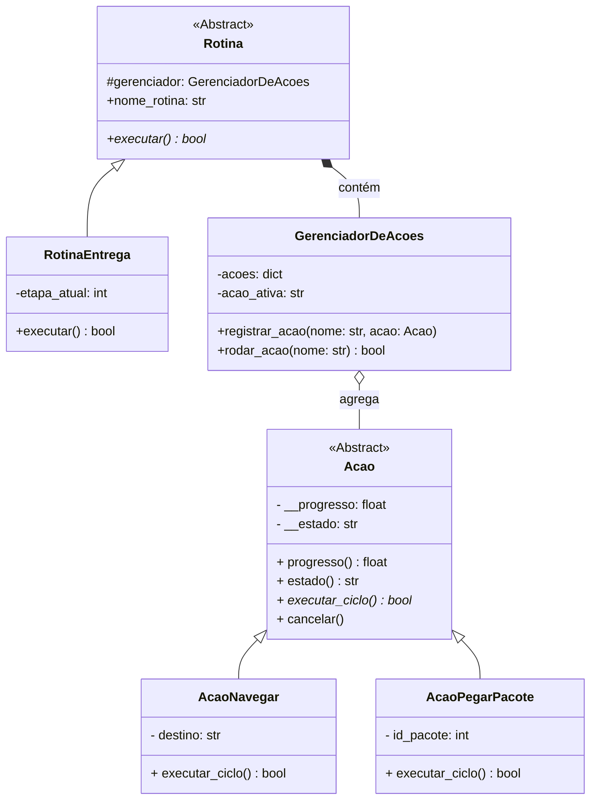

Aqui está um desafio de arquitetura de software projetado especificamente para exercitar os conceitos de Orientação a Objetos que discutimos (Composição, Polimorfismo, Classes Abstratas, Encapsulamento e Properties), usando uma estrutura análoga ao seu `MissionControl`.

### O Cenário: Coordenador de Frota de Drones Logísticos

Você está desenvolvendo o sistema interno de um Drone de armazém. O drone executa **Rotinas** (como a sua `Mission`), que são compostas por várias **Ações** (como as suas `Skills`). O drone possui um **Gerenciador de Ações** (como o seu `SkillsManager`).

Abaixo estão os diagramas UML e as regras de negócio rigorosas que você deve aplicar no código Python.

#### 1. Diagrama de Classes (A Arquitetura)



#### 2. Diagrama de Objetos (Um retrato do sistema em execução)

Este diagrama mostra o estado exato das instâncias na memória no meio de uma execução (útil para visualizar o encapsulamento em ação).

```mermaid
objectDiagram
    object rotina_01 {
        tipo = RotinaEntrega
        nome_rotina = "Entrega Expressa"
        etapa_atual = 1
    }
    
    object manager {
        tipo = GerenciadorDeAcoes
        acao_ativa = "navegar_prateleira"
    }
    
    object acao_nav {
        tipo = AcaoNavegar
        destino = "Corredor B"
        __progresso = 45.0
        __estado = "EXECUTANDO"
    }
    
    object acao_pegar {
        tipo = AcaoPegarPacote
        id_pacote = 9942
        __progresso = 0.0
        __estado = "AGUARDANDO"
    }

    rotina_01 -- manager : possui
    manager -- acao_nav : gerencia [ativo]
    manager -- acao_pegar : gerencia [inativo]

```

---

### Escopo e Regras de Negócio (O Desafio)

Sua missão é escrever o código Python que implemente essa estrutura, obedecendo **rigorosamente** às seguintes regras:

#### Regra 1: A Classe Abstrata `Acao` (O Contrato)

* Deve herdar de `ABC` (Abstract Base Class).
* **Encapsulamento Estrito:** Deve possuir dois atributos estritamente privados: `__progresso` (float, inicializado em `0.0`) e `__estado` (string, inicializado em `"AGUARDANDO"`).
* **Properties (Getters e Setters):**
* Você deve criar `@property` para ler o `progresso` e o `estado`. O mundo externo **não pode** alterar o estado diretamente (não deve haver um setter para estado).
* O setter de `progresso` deve conter uma lógica de validação:
* O valor deve estar entre `0.0` e `100.0` (se vier menor, trava em 0; se maior, trava em 100).
* **Efeito Colateral Automático:** Se o progresso inserido for maior que `0.0`, o estado muda internamente para `"EXECUTANDO"`. Se chegar a `100.0`, o estado muda automaticamente para `"CONCLUIDO"`.


* **Polimorfismo:** Deve ter um método abstrato `@abstractmethod def executar_ciclo(self) -> bool:`, que forçará as filhas a implementarem sua própria lógica.

#### Regra 2: As Classes Filhas (`AcaoNavegar` e `AcaoPegarPacote`)

* Ambas herdam de `Acao`.
* **Polimorfismo na Prática:**
* Na implementação de `executar_ciclo` de `AcaoNavegar`, a cada chamada, o progresso deve subir `10.0` pontos.
* Na implementação de `executar_ciclo` de `AcaoPegarPacote`, a cada chamada, o progresso deve subir `25.0` pontos (é uma tarefa mais rápida).


* O método `executar_ciclo` de ambas deve retornar `True` se a tarefa acabou (progresso == 100) ou `False` se ainda está rodando.

#### Regra 3: O `GerenciadorDeAcoes` (Composição de Entidades)

* Possui um dicionário privado `__acoes` que guarda os objetos do tipo `Acao`.
* Tem um método `registrar_acao(nome, acao_obj)` para popular o dicionário.
* Tem o método `rodar_acao(nome) -> bool`. Este método busca a ação no dicionário e chama o `executar_ciclo()` dela. Retorna o resultado para quem o chamou.

#### Regra 4: A Classe `RotinaEntrega` (Máquina de Estados)

* Herda de uma classe abstrata `Rotina` (que obriga a ter o método `executar()` e instancia o `GerenciadorDeAcoes` no `__init__`).
* Utiliza um `Enum` interno chamado `Etapas` (ex: `IR_ATE_PRATELEIRA`, `PEGAR_ITEM`, `FIM`).
* O método `executar()` deve ser uma máquina de estados (como o seu `match/case`).
* **Etapa 1:** Pede para o gerenciador rodar a ação de navegar. Só avança a etapa se o gerenciador retornar `True`.
* **Etapa 2:** Pede para o gerenciador rodar a ação de pegar pacote.
* **Etapa FIM:** Imprime "Rotina finalizada".


### O Teste de Mesa (Como validar seu código)

Para provar que seu código funciona e respeita o Polimorfismo e as Properties, você precisará rodar um loop simples (simulando um timer de ROS 2) no final do arquivo:

```python
# Setup inicial
rotina = RotinaEntrega()

# Loop de simulação a 10Hz
while True:
    acabou = rotina.executar()
    if acabou:
        break

```

*Se as regras forem seguidas, você verá a ação de navegação rodar 10 vezes (subindo de 10 em 10) até mudar de estado, e a ação de pegar rodar 4 vezes (subindo de 25 em 25).*

Você pode codificar a sua solução e enviá-la aqui. Posso revisá-la focando em como você aplicou o Type Hinting, as Properties de Python e a abstração!